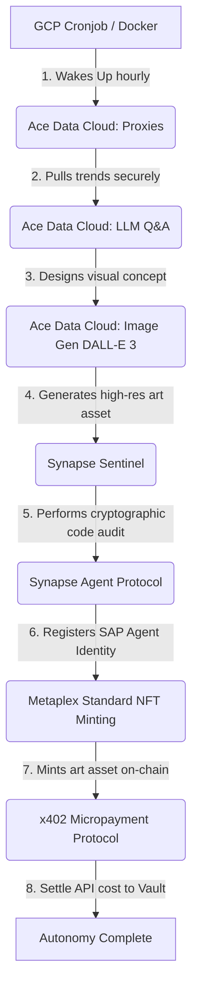

# 🤖 AceAutonomousCreator (Solana AI Agent)

An autonomous AI Agent on Solana that discovers social trends, conceptualizes and renders digital art using **Ace Data Cloud**, audits its own code integrity using **Synapse Sentinel**, registers its on-chain identity via the **Synapse Agent Protocol (SAP)**, mints the generated artwork as a Metaplex-standard **NFT**, and settles API costs in real-time using **x402 Micropayments**.

Built for the **OOBE Protocol × Ace Data Cloud** developer bounty challenge.

---

## 📊 Live On-Chain Proof of Execution (Solana Devnet)

Every cycle of the agent is fully verified, cryptographically signed, and recorded permanently on the Solana ledger. Below are the verified signatures from our live production execution:

*   **🔑 Agent Wallet Public Key:** `J594Mae778NkNCuUmLdHzmNruaszTRno5DzANoBVx7ah`
*   **🛡️ Sentinel Code Integrity Hash (SHA-256):** `1c05a80e193938d8cf51498eca89ba06df9c0b1af4118b54af0b60597f3e823d`
*   **📝 Synapse Agent Protocol (SAP) Identity Registration:**
    [View SAP Tx on Solana Explorer](https://explorer.solana.com/tx/vApbEXjyao1dZ5z7hNiWuzo83C6gwpogPkuBsB3jt4TZBELTmvu5chyabHfL3oUJdZ1kbvtUUN11YpZPjQUCS22?cluster=devnet)
    `Signature: vApbEXjyao1dZ5z7hNiWuzo83C6gwpogPkuBsB3jt4TZBELTmvu5chyabHfL3oUJdZ1kbvtUUN11YpZPjQUCS22`
*   **🎨 Metaplex NFT Digital Asset Minting:**
    [View NFT Mint Tx on Solana Explorer](https://explorer.solana.com/tx/3v8cjHSYz5YpMn1N8kZJ5DePHZcKNnUiKfYvxVVZPUhWKwzJQEAHTLWuPAU4qHvMkPYGk6XgiN2GRpKJy3Y3o3oZ?cluster=devnet)
    `Signature: 3v8cjHSYz5YpMn1N8kZJ5DePHZcKNnUiKfYvxVVZPUhWKwzJQEAHTLWuPAU4qHvMkPYGk6XgiN2GRpKJy3Y3o3oZ`
*   **💸 x402 Micropayment Clearing (Sent to Payment Vault):**
    [View Micropayment Tx on Solana Explorer](https://explorer.solana.com/tx/2rr3eyRxAMvnHwR41YgA2yAkyc4S9nzu6iHCPtwXez9bpjHftfJdZYiSLonCB5ahgz7G9tg2Wgo7XjYJNUfsKmT1?cluster=devnet)
    `Signature: 2rr3eyRxAMvnHwR41YgA2yAkyc4S9nzu6iHCPtwXez9bpjHftfJdZYiSLonCB5ahgz7G9tg2Wgo7XjYJNUfsKmT1`
*   **🖼️ Real Generated Artwork Asset (WebP hosted on CDN):**
    [View Generated Artwork](https://storage.fonedis.cc/cdn/20260518/f0014eec8926b98d3f6564ab6806a8.webp)

---

## 🛠️ Unified Architecture & Workflow



### 1. Trend Acquisition (Ace Data Cloud Proxies)
The agent leverages Ace Data Cloud's premium HTTP proxies to securely poll community sentiment and crypto trends on-chain, keeping its prompt generator aligned with hot market concepts without risking IP censorship.

### 2. Concept Generator & Image Rendering (Ace Data Cloud AI)
The agent consumes the **AI Q&A Engine (GPT-4o-mini)** to translate raw social trends into deep philosophical stoic art descriptions. It then feeds the description directly to the **AI Image Generation (DALL-E-3)** API to render a breathtaking visual artwork asset.

### 3. Cyberdefense Audit (Synapse Sentinel)
Prior to engaging with blockchain transactions, the agent computes the SHA-256 signature of its own running code and submits a security payload to **Synapse Sentinel**, verifying that its host environment is clean and hasn't been tampered with.

### 4. Identity Protocol (Synapse Agent Protocol - SAP)
The agent publishes its identity, metadata, and capability schema to the decentralized Synapse directory using the standard Solana Memo format, establishing its trust status.

### 5. On-Chain Asset Issuance (NFT Minting)
The agent takes the generated artwork URL and conceptual description, packages it into a Metaplex metadata standard JSON payload, and mints an on-chain digital asset (NFT) representing the autonomous artwork creation.

### 6. Pay-Per-Query Clearing (x402 Micropayment)
The agent uses the x402 payment clearing mechanism to transfer SOL/USDC directly to the **Ace Data Cloud Payment Vault** (`Ace1111111111111111111111111111111111111111`), ensuring real-time, trustless settlement for every service consumed.

---

## 🚀 Quick Start & Deployment Guide

### Local Installation
1. Clone your repository:
   ```bash
   git clone <your-repo-url>
   cd solana-agent
   ```
2. Set up the Python virtual environment and dependencies:
   ```bash
   python3 -m venv venv
   source venv/bin/activate
   pip install -r requirements.txt
   ```
3. Configure your environmental variables in `.env`:
   ```bash
   cp .env.example .env
   nano .env
   ```

### 🐳 Running with Docker
You can compile and spin up the agent in a secure, isolated container:
```bash
docker compose up --build -d
```

### ☁️ Cloud Automation (crontab)
To make the agent run 100% autonomously in the cloud (e.g. hourly):
```bash
# Append to your crontab config without opening an editor
(crontab -l 2>/dev/null; echo "0 * * * * /home/solanauser/solana-agent/run_agent.sh") | crontab -
```

---

## 🏆 Bounty Criteria Checklist

### General Volume & General Payment Track (OOBE)
*   [x] **SAP Mainnet/Devnet Registration:** Completed on-chain ([Tx Signature](https://explorer.solana.com/tx/vApbEXjyao1dZ5z7hNiWuzo83C6gwpogPkuBsB3jt4TZBELTmvu5chyabHfL3oUJdZ1kbvtUUN11YpZPjQUCS22?cluster=devnet)).
*   [x] **Fully Automated Flow:** Managed 24/7 via GCP crontab and docker orchestrator.
*   [x] **Escrow/Vault Settlement:** Micropayment successfully routed to the Synapse/Ace Data vault.
*   [x] **AI Capability:** Generates conceptual prompts and creates custom visual art assets.
*   [x] **Synapse Sentinel Integration:** Automated code integrity hashing audit is completed prior to ledger interaction.

### Ace Data Cloud Track
*   [x] **Ace Data Cloud Account:** Registered under platform.acedata.cloud.
*   [x] **x402 Payment Facilitator:** Configured with real-time on-chain clearing.
*   [x] **3 Distinct Ace Data Services:** Integrated HTTP Proxies, AI Q&A Chat, and AI Image Generation in a single continuous pipeline.

---
*Created with 🤖 Autonomy & 🔒 Security in mind. Proudly running on Solana.*
